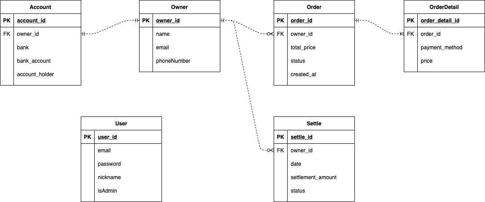

## Database


# 📄 API document

## User

### `POST` /user
#### parameter
|Name|Type|In|Description|
|---|---|---|---|
|email|String|body| |
|nickName|String|body| |
|password|String|body| |

<details>
<summary>
응답
</summary>

```json
{
  "id" : "Long"
}
```
</details>


### `POST` /user/login
#### parameters
|Name|Type|In|Description|
|---|---|---|---|
|email|String|body| |
|password|String|body| |

<details>
<summary> 응답 </summary>

```json
{
  "id": "Long"
}
```
</details>


## Owner

### `GET` /owner?...
#### parameters
|Name|Type|In|Description|
|---|---|---|---|
|id|Long|query-param|**Optional**찾고자하는 업주의 아이디값|
|name|String|query-param|**Optional**찾고자 하는 업주의 이름|
|email|String|query-param|**Optional**찾고자 하는 업주의 이메일|

<details>
<summary>
응답
</summary>

```json
{
  "id": "Long",
  "name": "String",
  "email": "String",
  "phoneNumber": "String"
}
```
</details>

### `POST` /owner
#### parameter
|Name|Type|In|Description|
|---|---|---|---|
|name|String|body| |
|email|String|body| |
|phoneNumber|String|body| |

<details>
<summary>
응답
</summary>

```json
{
  "id": "Long"
}

```

</details>

### `POST` /owner/{owner_id}/account
#### parameter
|Name|Type|In|Description|
|---|---|---|---|
|ownerId|Long|query-param|**Required**계좌를 추가하고자하는 업주 아이디|
|bank|String|body| |
|bankAccount|String|body| |
|accountHolder|String|body| |

<details>
<summary>
응답
</summary>

```json
{
  "id": "Long"
}

```
</details>

### `PUT` /owner
#### parameters
|Name|Type|In|Description|
|---|---|---|---|
|id|Long|body| |
|name|String|body| |
|email|String|body| |
|phoneNumber|String|body| |

<details>
<summary>
응답
</summary>

```json
{
  "name": "String",
  "email": "String",
  "phoneNumber": "String"
}
```
</details>

### `PUT` /owner/{owner_id}/account
#### parameters
|Name|Type|In|Description|
|---|---|---|---|
|ownerId|Long|query-param|**Required**계좌를 추가하고자하는 업주 아이디|
|id|Long|body| |
|bank|String|body| |
|bankAccount|String|body| |
|accountHolder|String|body| |

<details>
<summary>
응답
</summary>

```json
{
  "ownerName": "String",
  "bank":  "String",
  "bankAccount":  "String",
  "accountHolder":  "String"
}
```
</details>

## OrderTable

### `POST` /orderTable
#### parameters
|Name|Type|In|Description|
|---|---|---|---|
|ownerId|Long|body| |
|totalPrice|int|body| |
|status|String|body| |
|createdAt|DateTime|body| |
|detail|List<detail>|body| |
<details>

<summary>
detail
</summary>

```json
{
  "paymentMethod": "String",
  "price": "Integer"
}
```
</details>

<details>
<summary>
응답
</summary>

```json
{
  "id": "Long",
  "detailIds": ["Long"]
}
```
</details>

### `GET` /orderTable?owner-id=""&orderTable-id=""&created-at=""
#### parameters
|Name|Type|In|Description|
|---|---|---|---|
|ownerId|Long|query-param| |
|orderId|Long|query-param| |
|createdAt|DateTime|query-param| |

<details>
<summary>
응답
</summary>

```json
[
  {
    "ownerId": "Long",
    "orderId": "Long",
    "totalPrice": "Long",
    "status": "String",
    "createdAt": "DateTime"
  }
]
```
</details>

### `GET` /orderTable/{orderTable-id}/detail
#### parameters
|Name|Type|In|Description|
|---|---|---|---|
|orderId|Long|path-variable| |

<details>
<summary>
응답
</summary>

```json
[
  {
    "orderDetailId": "Long",
    "orderId": "Long",
    "paymentMethod": "String",
    "price": "int"
  } 
]
```
</details>